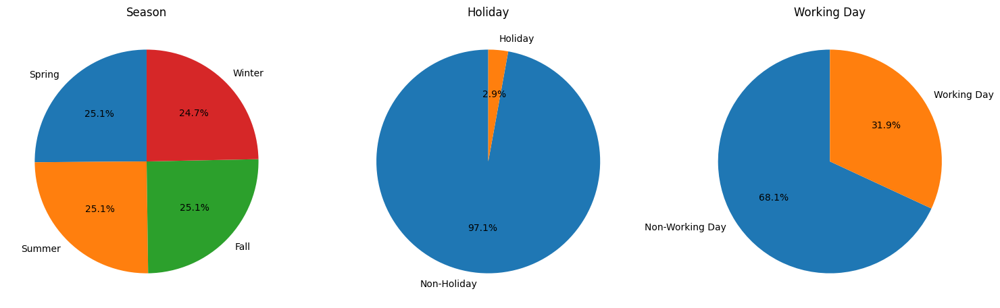

# Yulu Micro-Mobility Service Provider - Data Analysis Project

# About Yulu

Yulu is India’s leading micro-mobility service provider, which offers unique vehicles for the daily commute. Starting off as a mission to eliminate traffic congestion in India, Yulu provides the safest commute solution through a user-friendly mobile app to enable shared, solo and sustainable commuting.

Yulu zones are located at all the appropriate locations (including metro stations, bus stands, office spaces, residential areas, corporate offices, etc) to make those first and last miles smooth, affordable, and convenient!

Yulu has recently suffered considerable dips in its revenues. They have contracted a consulting company to understand the factors on which the demand for these shared electric cycles depends. Specifically, they want to understand the factors affecting the demand for these shared electric cycles in the Indian market.

## Overview
This project aims to analyze the factors influencing the demand for shared electric cycles provided by Yulu, India’s leading micro-mobility service provider. By examining a dataset related to bike rentals, this analysis explores various attributes impacting the demand for shared electric cycles in the Indian market.

## Dataset
The dataset used for this analysis contains information related to bike rentals and factors such as temperature, humidity, weather conditions, user types, and counts of bike rentals.

### Columns of Interest
- **temp:** Temperature
- **atemp:** Feels like temperature
- **humidity:** Humidity
- **windspeed:** Wind speed
- **count:** Count of bike rentals
- **registered:** Count of registered users
- **casual:** Count of casual users
- **season:** Season information
- **holiday:** Holiday status
- **workingday:** Working day status
- **weather:** Weather information

## Analysis Highlights
- **Descriptive Statistics:** Calculated mean, mode, median, variance, and standard deviation for multiple columns, and visualized histograms, count plots, and pie charts.
- **Correlation Analysis:** Examined correlations between variables using Spearman and Pearson coefficients. Found strong positive correlations between temperature and bike rentals, and negative correlations between humidity and bike rentals.
- **Hypothesis Testing:** Conducted hypothesis testing on population mean, variance, and mean differences between columns. Rejected null hypotheses for the mean and variance of bike counts.

## Key Insights
- Weather factors (temperature, humidity) significantly influence bike rental demands.
- Positive correlations exist between temperature, user types, and bike rental counts.
- Strategies targeting weather-based promotions and user engagement could potentially boost bike rental demands.

## Conclusion
   - Weather conditions, particularly temperature and humidity, significantly influence bike rental demands. Higher temperatures tend to increase demand, while higher humidity negatively impacts demand.
   - Additionally, registered and casual users strongly impact bike rental counts, suggesting that user base and weather conditions are crucial factors for Yulu's business model and marketing strategies.
## Some Graohs and Stats From Project

## Next Steps
- Further exploration into the effects of specific weather conditions on bike rentals.
- Implement targeted marketing strategies based on weather forecasts and user behavior.
